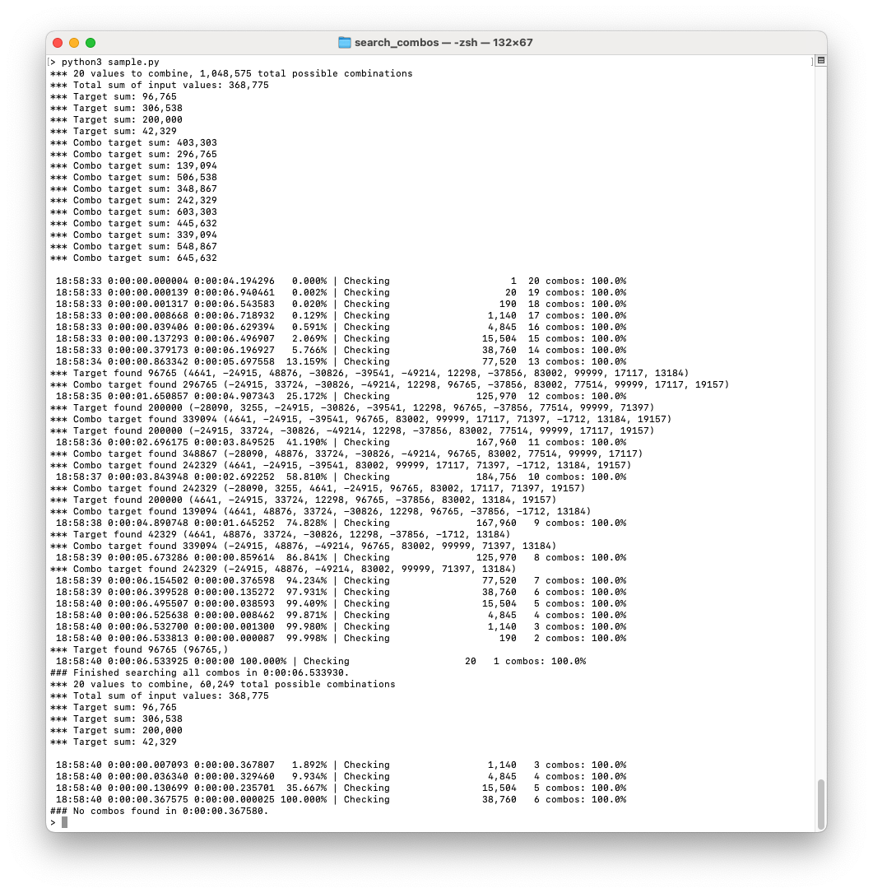

# search_combos - a useful python module
Search a list of values and find combinations matching a target sum.

This is a simple Python module use to find combinations that sum up a target value. Main usage is to match customer payments to open invoices.

### Some considerations
- The module is designed to be executed manually in a terminal, so it's mainly optimized to allow easy input and provide progress feedback.
- All values should be integers. If you need decimals, multiply the values by the factor needed to transform them to integers before feeding them to the module.
- The module assumes that the most probably combinations include almost all input values, thus the search starts with the combinations including all value. This can be changed using an input parameter.
- The module assumes the most probably combinations are towards the end of the value list, so the list is reversed by default before starting the search. This can be changed using an input parameter.
- To simplify the generation of check scripts, values are passed as space separated strings. It also accepts python lists or tuples.
- It allows to search for multiple targets in one run.
- It allows to search for a combined targets based on the list of initial targets. This is useful to combine partial payments and search for the values matching the total.
- Optionally, combined matches can be forther searched to split into individual targets.
- It allows negative values, so it can be fed a list positive and negative values to be combined.
- A range of values can be passed to the search function to limit the search to a certain amount of combinations. For example, limit the search to combinations of 10 to 15 values. This can be used to stop a search and restart later, skipping already searched combinations.
- To be continued...

### Usage
- save [search_combos.py](search_combos.py) to your working directory or somewhere in your $PYTHONPATH
- Create a Pythonscript importing the module and executing the find function with the input values and targets to find
- See [sample.py](sample.py) for examples

### See it in action

